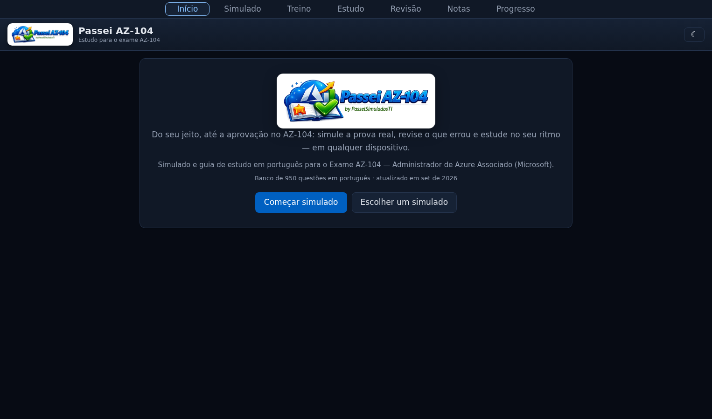
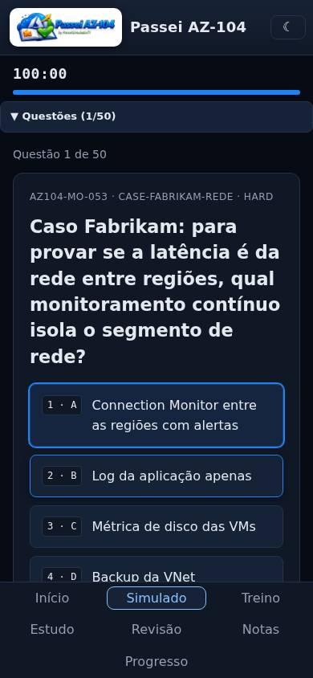

# Passei AZ-104 🎯

> Passe no AZ-104 treinando de verdade: simulados iguais à prova, revisão no ritmo certo e guia com links oficiais da Microsoft. Grátis, funciona offline.


[](https://github.com/ZeroBond85/PasseiAZ104/actions/workflows/ci.yml)
[](https://github.com/ZeroBond85/PasseiAZ104/actions/workflows/deploy.yml)
[](https://github.com/ZeroBond85/PasseiAZ104/actions/workflows/security.yml)
[](https://github.com/ZeroBond85/PasseiAZ104/actions/workflows/perf.yml)
[](LICENSE)

**👉 Use agora:** https://zerobond85.github.io/PasseiAZ104/

---

## O que é

Um app de estudos em **português (Brasil)** que simula a prova real (formato Pearson VUE), mostra **o que estudar** com links oficiais e usa **repetição espaçada (Leitner)** para fixar o conteúdo:

- **Simulado oficial** — 50 questões em 100 minutos, nota de 0–1000, aprovado com ≥700
- **Simulado dinâmico** — sempre diferente, mesmas proporções da prova
- **Study Hub** — domínios fracos + links Microsoft Learn priorizados + 🎯 Treinar meus erros
- **Revisão espaçada** — caixas 1/2/4/8/16 dias; o app cobra primeiro o que você mais erra
- **Treino por domínio** — 20 questões focadas, com pausa
- **Funciona offline** — baixa o banco uma vez, estuda sem internet (PWA instalável)
- **Login + sync** — entra com link mágico no e-mail e continua de onde parou em outro dispositivo (Supabase free, offline-first mantido); ou use sem conta (modo local)
- **Teclado + toque** — `1–4` responde, `←/→` navega, `⚑` marca para revisão
- **Tema escuro/claro** — escuro por padrão, preferência salva




## Banco de questões

**950 questões autorais em PT-BR** (a prova oficial existe em Português (Brasil) — este portal foi feito para ela), com explicação do porquê de cada erro, distribuídas como a prova:

| Domínio | Questões |
|---|---|
| Identidade e Governança (20–25%) | 230 |
| Storage (15–20%) | 170 |
| Compute (20–25%) | 230 |
| Rede Virtual (15–20%) | 175 |
| Monitoramento (10–15%) | 145 |

Tipos: escolha única (60%) · múltipla escolha (20%) · case study (15%, em blocos) · sim/não (5%).
Níveis: fácil 20% · médio 50% · difícil 30%.

Cada questão passa por validação automática (schema + regras por tipo + anti-duplicata) antes de entrar no banco.

Procedência honesta: as 950 são **autoria própria** (`source: original`), escritas em PT-BR e mapeadas
1:1 para o outline oficial vigente (skills 17/04/2026 — `syllabus-gap` prova cobertura total, sem gaps).
Não são cópias de questões da prova; explicações e Study Hub apontam para a documentação oficial.

## Como estudar (rotina sugerida)

1. **15 min de Revisão** (o app já prioriza a Caixa 1)
2. **Bloco de 30–40 questões** no Simulado
3. **Errou → lê a explicação** (ela diz por que cada alternativa errada está errada)
4. **Abra o Study Hub** (aba Estudo) e siga os links oficiais dos seus pontos fracos

**Quando marcar a prova:** média dos últimos 5 simulados ≥750 **e** nenhum domínio <70% **e** Caixa 1 com <10 cards. Detalhes em `docs/STUDY-PLAN.md` e `TUTOR.md`.

## Rodando localmente

Pré-requisitos: Node 24 (via `nvm`), Git. Todo o fluxo foi feito no **WSL Debian** (ver `docs/wsl-environment.md`).

```bash
git clone https://github.com/ZeroBond85/PasseiAZ104.git
cd PasseiAZ104
npm ci
npm run dev        # ambiente de desenvolvimento
```

```bash
npm run lint       # Biome (formato + regras)
npm run build      # tsc + build de produção
npm run test       # Vitest (unit + integração)
npm run validate   # valida as 950 questões (schema + unicidade + dedup)
npm run ci         # tudo acima, em sequência
npx playwright test  # e2e no navegador (quiz, offline, acessibilidade)
```

## Estrutura

```
├── PLAN.md / PLAN-3.md / LOG.md / LESSONS.md  # planos, diário e lições
├── AGENTS.md / REGRAS.md           # instruções operacionais
├── docs/                           # arquitetura, componentes, testes, estudo, deploy, API, troubleshooting, roadmap
├── src/
│   ├── engine/   # Quiz, Timer, Scoring (determinístico), Leitner, Selector, IRT, schemas Zod
│   ├── controllers/  # Quiz, Treino, Sync, Drill (classes puras, sem DOM)
│   ├── analytics/  # heatmap + distratores
│   ├── study/    # topics, hub, profile + flags
│   ├── sync/     # IndexedDB (sessões, progresso, questões) + Supabase (auth, SyncEngine espelho)
│   ├── data/     # carregador fetch → SW cache → IDB (bundle nunca embute o banco)
│   └── components/  # Lit sem decorators: shell, login, questão, timer, navegador, revisão, stats, tema, usuário, hub
├── data/         # banco particionado por subdomínio (≤200KB/arquivo) + 10 simulados + meta + topics + syllabus
├── scripts/      # validate, generate (IA), new-question, check-model, build-simulados, import-community, curadoria
├── supabase/migrations/  # 001 tabelas+RLS · 002 plataforma+admin · 003 self-update · 004 study hub
└── tests/        # unit, integração, e2e (Playwright + axe)
```

## Qualidade (números verificáveis)

- `npm run ci` verde: lint (Biome) + `tsc` + 67 testes unit + validate 950/0
- e2e (16 specs): quiz fim-a-fim, treino (sem `alert`), offline (IDB + SW cache), tema/flags/timer, **axe 0 violações**
- Lighthouse ≥90/90/90 (perf/a11y/boas práticas) · JS 123.5KB/teto 140KB gzip
- Hooks: pre-commit <10s (segredos, lint, tamanho) · pre-push roda o CI completo
- Segurança: `.env` nunca commitado (gitleaks), senha Postgres nunca em chat/repo, RLS como fronteira, CSP via meta tag
- Curadoria mensal automática: links MS Learn, banco, outline oficial + backup semanal

## Contribuindo

Leia `CONTRIBUTING.md`, `REGRAS.md` e `docs/QUESTION-GUIDELINES.md`. Resumo: questão nova via `npx tsx scripts/new-question.mts` + checklist de qualidade + `validate` limpo; falha no CI vira teste de regressão + lição no `LESSONS.md`.

## Licença

MIT — ver `LICENSE`. Feito para estudar e passar. Boa prova! 🚀
