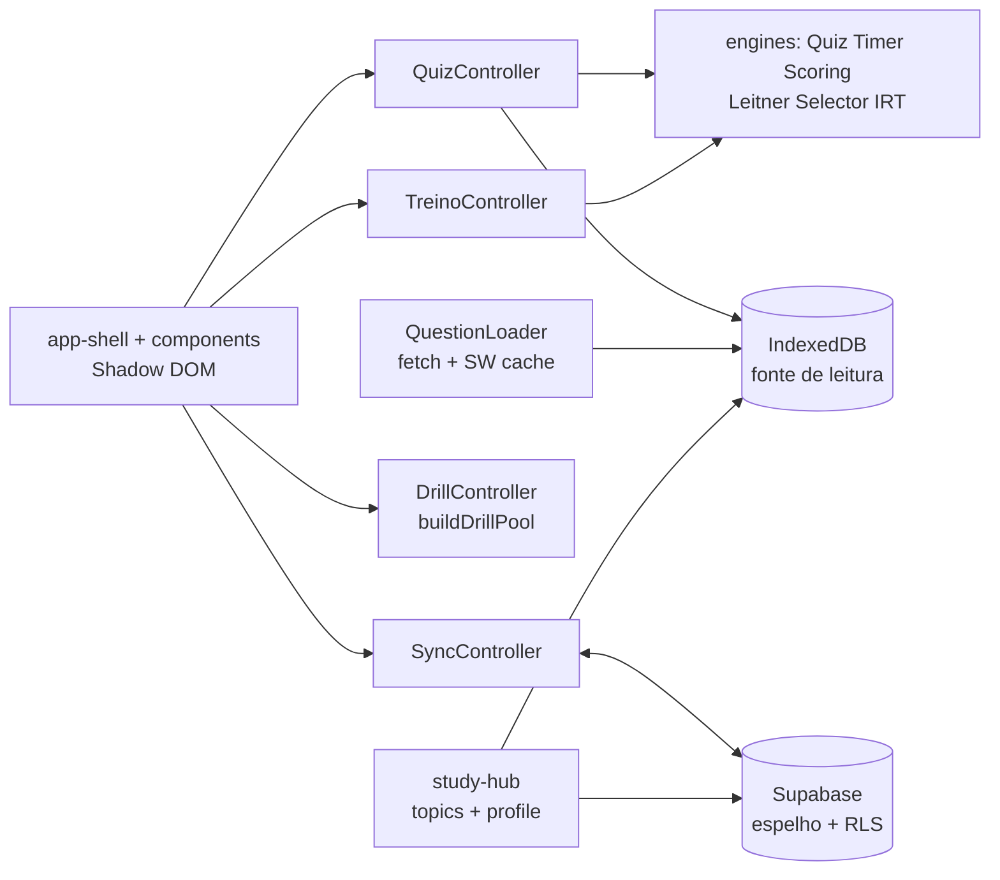

# ARCHITECTURE.md — PasseiAZ-104

> Decisões (ADRs) + mapa do sistema. Fonte da verdade: `PLAN.md` v7.0.

## ADR-001 — QuestionLoader: fetch + SW runtime cache + IDB primeiro (rev. Sprint 2)

- Banco em `data/*.json` (particionado ≤200KB, §9). `public/data` é symlink → `../data`, seguido pelo Vite para `dist/data`.
- 1ª carga (online): `fetch()` valida (Zod) e semeia o IDB; seguintes: IDB primeiro.
- **SW participa de verdade desde a Sprint 2:** `workbox.runtimeCaching` StaleWhileRevalidate
  p/ `/data/*.json` (cache `az104-questions`, 20 entradas, 30 dias, só `response.ok`) —
  sem rede, o seed volta do SW mesmo com IDB limpo (provado em `offline.spec.ts`).
  Antes da Sprint 2 o SW só fazia precache do shell (o nome antigo do ADR era enganoso).
- Falha parcial de seed nunca marca versão (throw + retry na UI, LESSONS 2026-09-25).
- Bundle nunca embute o banco.

## ADR-002 — Writer único de sessão

- `QuizEngine.snapshot()` grava tudo (respostas + `timerRemaining`) a cada 30s numa transação IDB.
- `TimerEngine` só expõe `remaining`; nunca grava (sem corrida de records).

## ADR-003 — Scoring determinístico

- `W={easy:15, medium:20, hard:25}`; `maxRaw` por dificuldade; múltipla `w×(k/n)`, erro zera; `round(raw/max×1000)`; corte 700; `weakAreas<70%`.

## ADR-004 — Seleção determinística

- Fisher-Yates + mulberry32 (seed do simulado); quotas por domínio via largest-remainder; exclui últimas 100/domínio; `usageCount` ASC.

## ADR-005 — Backend espelho (v6.0, Supabase free)

- IDB = fonte de leitura (offline-first intacto); Supabase = espelho (`az104_progress`, `az104_sessions`).
- Auth magic link; gate sem sessão → `login-screen`. RLS `auth.uid() = user_id` em tudo.
- Merge: last-write-wins por `updatedAt`; `box` usa `max()` (Leitner nunca regride).
- Build sem env = modo 100% local; deploy usa GitHub Secrets. `?local=1` = bypass só p/ e2e.

## ADR-006 — Admin via RLS com `az104_is_admin()` SECURITY DEFINER (v7.0, migration 002)

- **Problema:** aba Admin lê registros de todos os usuários; com RLS `auth.uid() = user_id` pura, o
  select só enxerga o próprio — seria preciso política `auth.uid() IN (SELECT ...)` duplicada em toda
  tabela, com risco de "leak de admin" se esquecida.
- **Decisão:** função `az104_is_admin()` (SECURITY DEFINER, `search_path=public`, `stable`) consultando
  `az104_profiles.role='admin'` por `auth.uid()`. Cada tabela da plataforma declara **duas** políticas:
  `all` para o dono (`user_id = auth.uid()`) e `select`/`update` liberado para `az104_is_admin()`.
  `az104_admin_logs` é admin-only (nem o dono lê). `az104_profiles` permite admin-update do `role`.
- **Client:** `upsertOwnProfile` grava só `user_id`+`email` (nunca `role`); `getProfileRole` lê `role`
  anônimo; `AppShell.isAdmin` controla a aba. RLS **é** a fronteira de segurança — a aba é só UX.
- **Trade-offs:** função só lê (nunca escreve); `SECURITY DEFINER` sem privilégios além de `select`
  (não há senha/chave no SQL); se `az104_profiles` não tiver o registro (migration não aplicada),
  `az104_is_admin()` retorna falso → aba some dos não-admins (fail-closed).

## ADR-007 — Experiência por usuário: attempts/doubts/activity/suggestions (v7.0, P2/P3/P4)

- `az104_attempts` é **append-only** (imutável após finalizar; `error_tags` só é preenchido se vazio).
  Confere histórico contra-corrupção e análise por questão no Admin.
- `az104_activity_log` usa PK `(user_id, activity_date, kind)` — superset do streak (dia ativo =
  simulado OU ≥10 questões OU ≥1 dúvida); merge por `createdAt`.
- Study Guide roda em **client-side** (`analyzeAttempt`, determinístico, custo $0); snapshot diário em
  `az104_study_suggestions` para histórico sem re-render.
- Streak/readiness §12 são derivados localmente (activity_log + progress), consistentes offline.

## ADR-008 — Controllers puros fora do app-shell (Sprint 3, PLAN-3)

- **Problema:** `app-shell.ts` com 1324 linhas misturava quiz/treino/sync/atalhos — God Component.
- **Decisão:** `src/controllers/` com classes puras (`QuizController`, `TreinoController`, `SyncController`,
  `DrillController`): recebem `notify` + leem stores; zero DOM. Shell vira orquestrador fino
  (1324→1061 linhas; meta <500 reavaliada — restam CSS+templates, fatiar mais criaria prop-drilling).
- **Achados na extração:** placar do treino sempre 0 (engine sem `load()`), treino sem `ensureSeeded()`
  (botão morto em perfil zerado) — ambos invisíveis por falta de e2e de treino (LESSONS).

## ADR-009 — Study Hub: tópicos curados + perfil por usuário (Sprint 4, PLAN-3)

- **Problema:** pós-simulado dizia *onde* errou, mas não *o que estudar nem onde* (links).
- **Decisão:** `data/study-topics.json` (~34 tópicos MS Learn PT-BR, match por prefixo de subdomain)
  + `az104_study_topics` (read-auth/write-admin) + `az104_study_profile` (own-rows: vistos, fracos,
  drills, preferências; localStorage + espelho). `generateStudyPlan` recalcula a cada load
  (fracos <70% nos últimos 5 → top 10 links). CI mensal valida URLs (PR auto p/ redirect, issue p/ morta).
- **Trade-offs:** tópico sem cobertura cai no fallback por domínio; links externos exigem rede
  (`target="_blank" rel="noopener"`).

## ADR-010 — IRT 1PL com gate de amostra (Sprint 4, PLAN-3)

- **Decisão:** `src/engine/irt.ts` estima dificuldade `b = log((1-p)/p)`; `calibrate-irt.mts`
  gera `data/irt-params.json` a partir do CSV do Admin. **Gate: n≥30**, sem amostra = fora
  (estimativa com poucas respostas é ruído com falsa precisão). Selector integra quando houver dados reais.

## Mapa

- `src/engine/`: Quiz, Timer, Scoring, Leitner (1/2/4/8/16d, cap 50), Selector, **IRT 1PL (gate n≥30)**,
  `question-schema.ts` (Zod §3), Explanation (só lê), **StudyGuide** (analyzeAttempt + readiness §12).
- `src/controllers/`: **quiz/treino/sync/drill** (classes puras, sem DOM).
- `src/analytics/`: **heatmap** (subdomain×tipo×dificuldade + trend) + **distractor** (>40%).
- `src/study/`: **topics** (Supabase c/ fallback JSON) + **study-hub** (`generateStudyPlan`, `buildStudyLinks`) + **study-profile** (localStorage + espelho).
- `src/config/flags.ts`: feature flags (`study-hub`, `drill` ON).
- `src/sync/`: IDB v2 (sessions/progress/meta/questions/**attempts/doubts/activity/suggestions**) + tipos **(Zod fonte única)** + `supabase.ts` + `auth.ts` + `SyncEngine.ts` + **`study-sync.ts`**.
- `src/data/`: QuestionLoader (ADR-001; 8 arquivos particionados).
- `src/components/`: app-shell (gate+header+nav dinâmica), login-screen, user-menu, question-card (radiogroup), timer-bar, navigator-grid, review-card (+tags de erro ×5), stats-dashboard, theme-toggle, **study-guide** (+links MS), **progress-panel** (+heatmap), **admin-panel** (+roles, review queue, sparkline, logs), **study-hub-panel**, **study-link-card**, modal-dialog (confirm/success/info), catalog-screen (dinâmico primeiro ★), estudo-card.
- `src/styles/`: tokens OKLCH + escala fluida (variables), global, components, dark.
- `scripts/`: validate (Zod+FK+dedup FNV-1a), generate (IA + checkpoint), check-model (probe), build-simulados (seeded), import-community (quarentena), render-icons (source.png → derivados letterbox), **new-question (interativo+lote)**, **bump-bank-meta**, **calibrate-irt**, **syllabus-gap**, **validate-migration-types**, **validate-study-links**, **question-curation**, **check-exam-outline**, **update-readme-test-count**.
- `supabase/migrations/`: 001 (tabelas + RLS + índices) + **002** (plataforma por usuário + admin, ADR-006) + 003 (self-update email) + **004** (study topics + profile).
